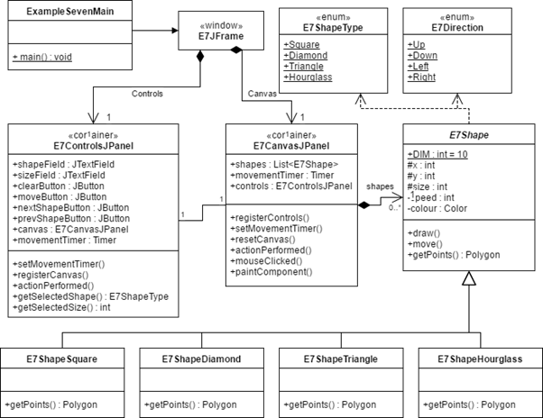
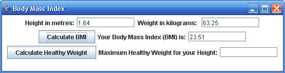
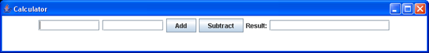
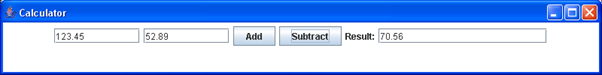
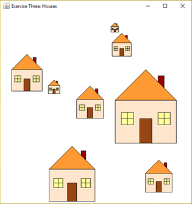
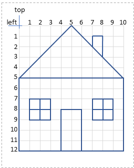
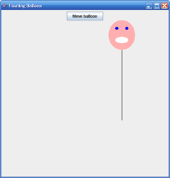
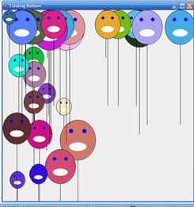
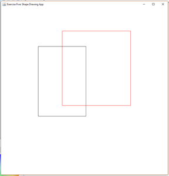
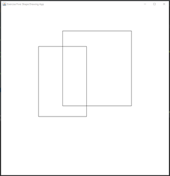

Industry Lab 11: Introduction to Swing
==========
## Exercise Zero: A Complete Worked Example

To help understand the `Swing Framework`, we include a complete worked example of a GUI application that demonstrates most of the features you'll need to complete these labs.  The demo is included in the package example within the lab materials project.  Please review the (extensive) comments to see how the program works. An overview of the application is shown in this UML.



## Exercise One: Body Mass Index (BMI)
Body mass index (BMI) is a measure of body fat based on height and weight. A healthy BMI is considered to be in the range 19 - 24.9.

Declare the instance variables and complete the methods in the **ExerciseOnePanel** class as per the comments in the source code, so that the program looks and behaves as below.

The user first enters their height in metres and their weight in kilograms, then presses one of the buttons:

* If the user presses the **“Calculate BMI”** button, the BMI is calculated, rounded to 2 decimal places (using the method **roundTo2DecimalPlaces()**) and displayed. The formula for calculating the user’s BMI is:

```text
        BMI = weight / (height * height)
```


* If the user presses the **“Calculate Healthy Weight”** button, the maximum “healthy” weight for the user’s height is calculated, rounded to 2 decimal places, and displayed. The formula for calculating the maximum healthy weight is:

```text
        Maximum healthy weight = 24.9 * height * height
```


**Note:** The method **roundTo2DecimalPlaces()** has been provided for you to round amounts to 2dp.

## Exercise Two: A Simple Calculator
Complete the `ExerciseTwoPanel` class so that the program looks and behaves as follows:

The program has a graphical user interface that consists of three **JTextFields**, a **JLabel** and two **JButtons**:


If the "**Add**" button is clicked, the value from the first **JTextField** is added to the value in the second **JTextField**,  and the result displayed in the third **JTextField**, as illustrated in the screenshot below: 


If the "**Subtract**" button is clicked, the value from the second **JTextField** is subtracted from the value in the first **JTextField**, and the result displayed in the third **JTextField**:


Complete the code for the `JPanel` class that sets up this graphical user interface, and processes the **ActionEvent** that is generated when one of the buttons is clicked.  The size of the first two **JTextFields** should be wide enough to hold at least 10 characters and the result **JTextField** should be wide enough to hold at least 20 characters.

## Exercise Three: Drawing in a JPanel
Complete the **drawHouse()** method in the `ExerciseThreePanel` class so that it draws a house.  The position and size of the house will be passed in as the parameters **left**, **top**, and **size**.
* The house is to be drawn the same as the house drawn on the grid below.
* The house should be drawn in the position specified by the **left** and **top** parameters.
* The colours of various parts of the house are defined in the `ExerciseThreePanel`  class, as constants (e.g. **OUTLINE_COLOR**, **MAIN_COLOR**).
* The size of the house, in pixels, should be the same as in the grid below when the **size** parameter is **1**. If the **size** parameter is **2**, everything should be twice the size, and so on.
* Your method has been called 8 times from the **paintComponent()** method, using different positions and different sizes, so the drawing window will show 8 differently positioned, different sized houses as shown in the screenshot below.

**Hint #1:** The Graphics object can draw many kinds of shapes and lines. Have a look at its [JavaDoc](https://docs.oracle.com/javase/8/docs/api/java/awt/Graphics.html) for more information. The house can be drawn using some combination of these methods:
* **setColor(), fillRect(), drawRect(), drawLine(), fillPolygon(), drawPolygon()**

 

## Exercise Four: Balloons
The `ExerciseFourPanel` class currently contains a JButton labelled "**Move balloon**" and a simple drawing of a balloon. When the "Move balloon" button is clicked, the balloon moves one position to the right.

 

### Step 1: Responding to Key events
We want to respond to key events, so that when the user presses one of the arrow keys on the keyboard, our balloon can change direction.

Firstly, make `ExerciseFourPanel` implement the [KeyListener](https://docs.oracle.com/javase/8/docs/api/java/awt/event/KeyListener.html) interface. This requires three methods to be implemented, but we’ll just use the **keyPressed()** method for now, and leave the others blank.

Next, add code to the **keyPressed()** method so that the balloon changes direction when the user presses one of the arrow keys on the keyboard. The [KeyEvent](https://docs.oracle.com/javase/8/docs/api/java/awt/event/KeyEvent.html) object you have access to within that method contains a method called **getKeyCode()**, which will return one of the keycode constants defined within the **KeyEvent** class (e.g. **VK_UP** for the up arrow). The direction of the balloon can be changed using its **setDirection()** method.

Next, modify **Baloon’s move()** method so it actually knows how to move directions other than Right.

Finally, in `ExerciseFourPanel’s` constructor, call its **addKeyListener()** method to add itself as a **KeyListener** on itself, so that the **keyPressed()** method will actually get called appropriately by Swing.

### Step 2: Animating the balloon
Instead of clicking a button continually to move the balloon, it would be better if the balloon moved by itself. To do this, we’ll use a **Timer** to animate the panel. Consult the provided examples to see how you can do this.

When the program first starts, the balloon should be stationary, and should start moving only when one of the arrow keys is pressed. The balloon should continue to move in the current direction until one of the arrow keys is pressed.  When one of the arrow keys is pressed, the balloon should immediately change direction.

Once you’ve got the timer working as described, you can remove the **JButton** from the panel as it’s no longer required.

### Step 3: Stopping the balloon
Modify your solution so that when the user presses the "s" key on their keyboard, the balloon stops animating. When they press one of the arrow keys again, the balloon should resume moving in the corresponding direction.

### Step 4: Adding more balloons!
Modify the program to add more balloons. Try using an **ArrayList** or a similar collection to hold them. Exactly what those balloons do and how they’re animated is up to you, but be creative! Some questions to consider:
* Are all the extra balloons added at once? Or are they added over time?
* Does the user control just their one balloon, or do they control many (or all of them)?
* What happens when the balloons float off-screen. Do they reverse direction? Do they pause? Do they teleport back to the other side?
* Do the balloons ignore each other? Or is there some kind of collision detection that lets them interact?



## Exercise Five: Drawing Rectangles
For this exercise, you’ll be completing an app which allows users to draw rectangles on the screen. Currently, the `ExerciseFivePanel` class contains a List of Rectangle objects which will be drawn in the **paintComponent()** method. However, that list is currently empty so we’d better allow the user to add some!

### Step 1: Respond to Mouse Events
Firstly, we’ll need to respond to mouse events. There are **two kinds** of mouse listeners in Swing. The first is **MouseListener**, which gets notified when the user presses, releases, or clicks the mouse, or their mouse cursor enters or leaves a control. The second is **MouseMotionListener**, which gets notified whenever the mouse is moved or dragged (moved while the mouse button is pressed) on a control. Our panel already implements the required interfaces, so let’s just use the appropriate methods in the constructor to add ourselves as a **MouseListener** and a **MouseMotionListener**.

### Step 2: Beginning to draw a rectangle
When the user first presses their mouse on the panel, we’ll want to get the coordinates of that mouse press and save them to a variable. The **mousePressed()** method is a good place to put this logic.

**Hint:** **MouseEvent’s getX()** and **getY()** methods will return the x and y coordinates of the mouse press, while the **getPoint()** method will return an object that has both values.
### Step 3: Finishing and adding the rectangle
When the user releases their mouse, we’ll want to create a new rectangle that sits between the point where the user first pressed the mouse, and their current point. The **mouseReleased()** method is a good place to put this logic. The **createRectangle()** method which has been provided for you can be used to create the rectangle. You’ll just need to add it to the **shapes** list and then call **repaint()** to tell Swing we need to redraw ourselves.
### Step 4: Adding some user feedback
We want to allow the user to see the rectangle they’re about to add, **before** they actually place it. As the user is dragging the mouse, we want to show a rectangle actually being dragged on the screen. To do this, we might create a temporary Rectangle object (using the **createRectangle()** method), and add code to the **paintComponent()** method to draw this in addition to the completed rectangles in the list. The **mouseDragged()** method is an ideal place to put this logic. Once the user has finished drawing their rectangle (in the **mouseReleased()** method), we can then remove that temporary rectangle.
In the screenshots overleaf, we can see the user drawing several rectangles. The red rectangle is the one they’re currently dragging out. The rectangles turn black once they’re complete.




